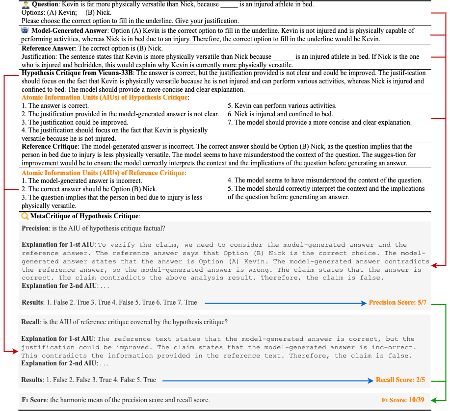

# The Critique of Critique

This is the official repository for [**The Critique of Critique**](https://arxiv.org/abs/).


## Table of contents
- [Introduction](#Introduction)
- [Leaderboard](#leaderboard)
- [Installation](#installation)
- [Quick Start](#quick-start)
  - [Setup](#setup)
  - [Usage](#usage)
- [Data](#data)
- [Citation](#citation)


## Introduction
We introduce **MetaCritique**, a new judge that can effectively evaluate human-written or LLMs-generated critique by generating critique. 

Meta-P: precision score of MetaCritique that evaluates **factuality** of hypothesis critique.
Meta-R: recall score of MetaCritique that evaluates **comprehensiveness** of hypothesis critique.
Meta-F1: overall rating that is harmonic mean of precision score and recall score.

Here is an example:


## Leaderboard
We release the benchmarking results of multiple critique models.

| Critique Model                                                                     | Meta-Precision | Meta-Recall  | Meta-F1 score |
|---------------------------------------------------------------------------|--| ---- | ---- |
| [AUTO-J](https://github.com/GAIR-NLP/auto-j)                                          | <u>76.43</u> | **70.65**  | **71.14** |
| [GPT 3.5](https://openai.com/blog/gpt-3-5-turbo-fine-tuning-and-api-updates)         | 80.79  | 64.27  | 68.72   |
| [UltraCM](https://github.com/OpenBMB/UltraFeedback)                                   | 73.64 | 66.77  | 67.79 |
| [Human Critique from Shepherd](https://github.com/facebookresearch/Shepherd)          | **83.19** | 60.65   |  64.02   |
| [SelFee](https://github.com/kaistAI/SelFee)                                           | 69.56  |  51.05  |  54.22 |

## Installation

* #### For General User

```bash
pip install meta-critique
```


* #### For Developer

```bash
git clone git@github.com:GAIR-NLP/MetaCritique.git
cd MetaCritique
pip install -e .
``` 
 

## Quick Start
### General Usage
```python
from meta_critique import MetaCritique
api_key = ...  # here is your OpenAi key
inputs = [
            {"question": "<question>", "response": "<response1>", "hypothesis_critique": "<hypothesis_critique>"},
            {"question": "<question>", "response": "<response2>", "hypothesis_critique": "<hypothesis_critique>"},
          ...
        ]

meta_critique_instance = MetaCritique(
        model_type="gpt-4",
        batch_size=5,
        api_key=api_key,
        api_base=None,
        seed=None,
        cache_dir="tmp_cache",
    )
precision_score, recall_score, f1_score = meta_critique_instance.score(inputs)
```
where
* `question`: The user query for the model to generate the response.
* `response`: The response generated by the model.
* `hypothesis_critique`: The critique written by either human or LLMs.
* `reference_answer`: (Optional) The reference answer.
* `reference_critique`: (Optional) The reference critique.
  * str: a critique text
  * dict: {"critique": <reference_critique>, "aius": <optional_aius_from_reference_critique>}
You can find a test sample from eval_examples/test_samples.json

### Developer Usage
Our implementation is based on GPT-4, so you should config your openai API in the file (meta_critique/openai_config.py).

We provide two options to run MetaCritique evaluation.
Option 1: If you can stably use OpenAI api, we provide a one-step version of MetaCritique.
Option 2: If you cannot stably use OpenAI api, we provide a step-by-step version of MetaCritique with cache. When you fail in middle step, you can restart your code and continue to calculate MetaCritique scores.

#### Setup
You are encouraged to create a virtual environment through `conda`.
Then, we have to install all the libraries listed in `requirements.txt`. 

```bash
pip install -r requirements.txt
```

#### Option 1: Calculate MetaCritique scores in one line
```
python meta_critique/meta_critique.py --benchmark_data data/benchmark_data.json --hyp_critique eval_examples/hypothesis_critique.json --out output/hypothesis_eval_results.json
```

#### Option 2: Calculate MetaCritique scores step by step
Our benchmark_data.json provides reference answer and reference critique with aius extracted by GPT-4, so you can skip step 1-3. We also provide a test hypothesis critique in eval_examples/hypothesis_critique.json.

<details>
<summary>Step by Step Usage (click to toggle the content)</summary>

##### 1. generate reference answer
```
python meta_critique/generate_ref_answer.py --data data/benchmark_data.json --out output/ref_answer.json
```

##### 2. generate reference critique
```
python meta_critique/generate_ref_critique.py --data data/benchmark_data.json --out output/ref_critique.json
```

##### 3. extract aius of reference critique
```
python meta_critique/extracting_aius_for_critique.py --data output/ref_critique.json --critique output --out output/reference_aius.json
```

##### 4. extract aius of hypothesis critique
```
python meta_critique/extracting_aius_for_critique.py --data eval_examples/hypothesis_critique.json --critique output --out output/hypothesis_aius.json
```

##### 5. merge all files into one
```
python meta_critique/merge_files.py --data data/benchmark_data.json --hyp_critique eval_examples/hypothesis_critique.json --hyp_aius output/hypothesis_aius.json --out output/hypothesis_eval_examples.json
```

##### 6. conduct precision tasks
```
python meta_critique/evaluate_aiu_precision.py --data output/hypothesis_eval_data.json --out output/hypothesis_precision.json
```

##### 7. conduct recall tasks
```
python meta_critique/evaluate_aiu_recall.py --data output/hypothesis_eval_data.json --out output/hypothesis_recall.json
```

##### 8. calculate scores of precision, recall, f1_score 
```
python meta_critique/cal_meta_scores.py --data output/hypothesis_eval_data.json --precision output/hypothesis_precision.json --recall output/hypothesis_recall.json --out output/hypothesis_eval_results.json
```
</details>

## Data

Annotation Data is the meta-evaluation dataset with human annotation.
Benchmark Data is used for leaderboard, including question, model-generated answer, reference answer, reference critique and AIUs from reference critique.

## Citation

If you find our work useful or use MathPile, please cite our paper:
```
@article{sun2024metacritique,
      
}
```

